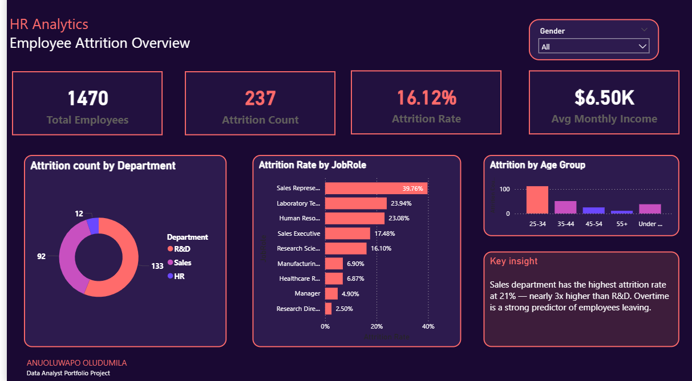
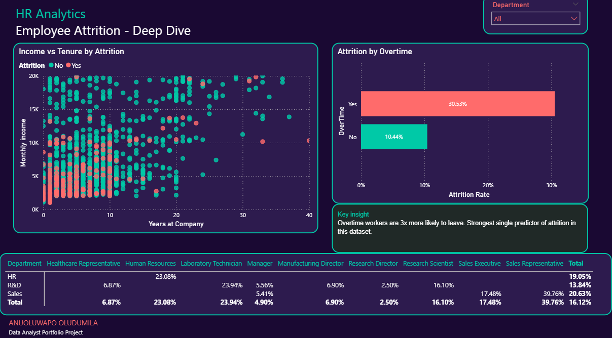

# IBM HR Analytics: Employee Attrition & Performance Dashboard

## 📌 Project Overview
This project analyzes a fictional dataset provided by IBM to identify the primary factors contributing to employee attrition. The goal was to transform raw HR data into an interactive **Power BI** dashboard that provides stakeholders with actionable insights into workforce retention.

## 📊 Key Metrics
* **Total Employees:** 1,470
* **Attrition Rate:** 16.12%
* **Avg Monthly Income:** $6.50K
* **High-Risk Dept:** Sales

## 🛠️ Technical Skills Applied
* **Data Transformation:** Cleaned and modeled data using **Power Query**.
* **DAX Calculations:** Developed custom measures for Attrition Rate and Count.
* **UI/UX Design:** Implemented a high-contrast dark theme with a focus on "Key Insight" text boxes to guide user attention.

## 💡 Key Insights
Based on the **Deep Dive** analysis:
1. **Overtime Impact:** Employees working overtime are **3x more likely to leave** (30.53% vs 10.44%).
2. **Role Specifics:** Sales Representatives show the highest vulnerability, with an attrition rate nearing 40%.
3. **Income vs. Tenure:** Attrition is concentrated among lower-income earners regardless of years at the company.

## 📸 Screenshots

---
*Created by Anuoluwapo Oludumila | Data Analyst Portfolio Project*
